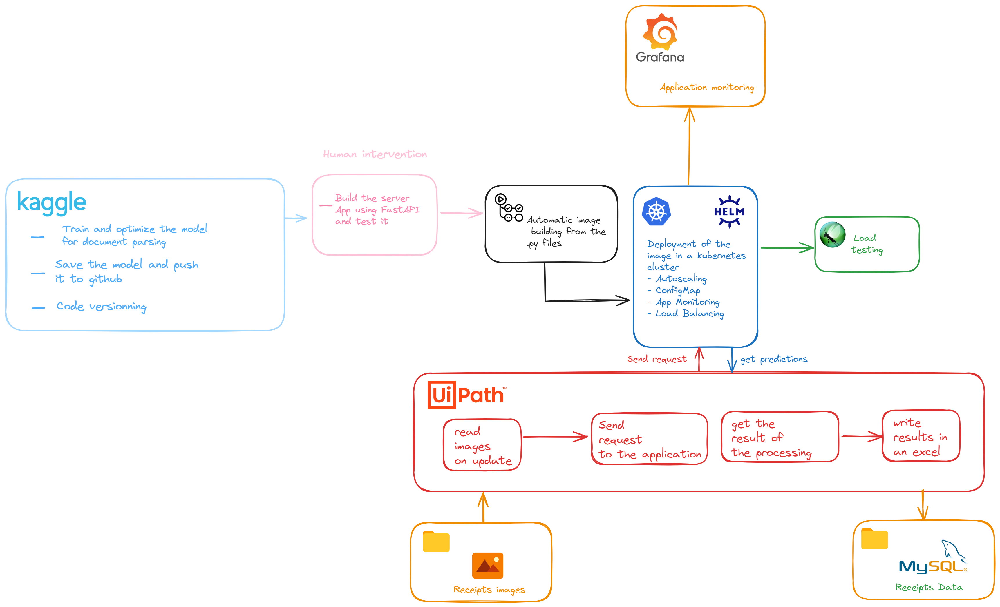

# Receipt Parser Application

Receipt Parser Repository
This repository serves as an end-to-end scalable solution for parsing receipts. It integrates various technologies and tools to streamline the process:

- **Python**: Utilized for model training and implementation.
- **GitHub Actions**: Ensures continuous integration and deployment  workflows.
- **Kubernetes**: Orchestrates deployment and scaling of the application.
- **UiPath**: Automates user-related processes for enhanced efficiency.
- **MySQL**: Stores parsed receipt data securely.
- **Prometheus and Grafana**: Monitors application performance and health metrics.

## Architecture 
